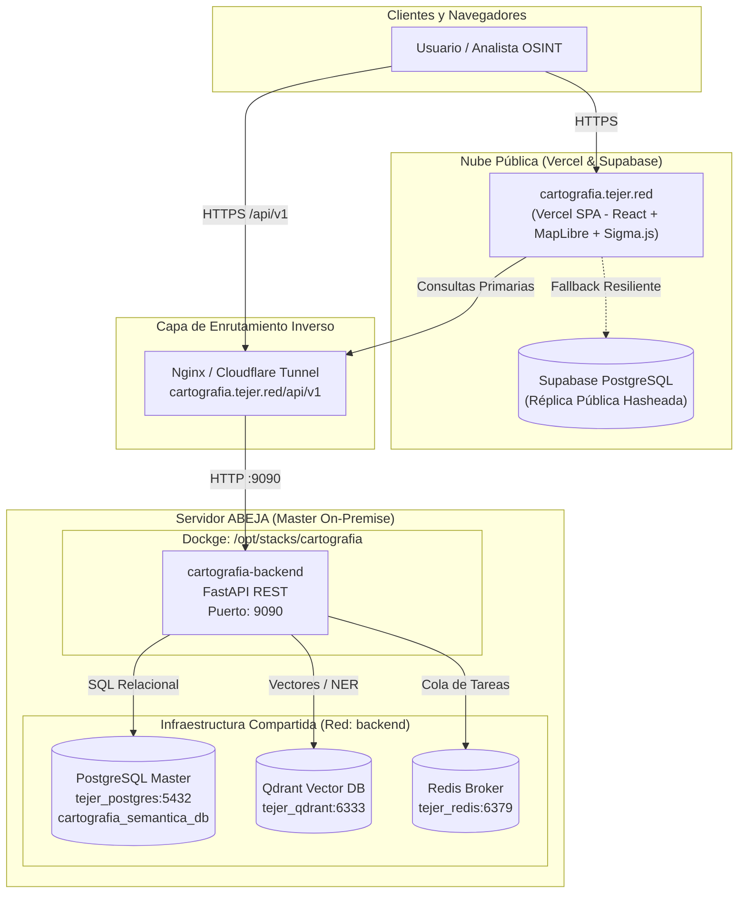

# 🛰️ Catálogo de Microservicios y Topología de Red

Este documento detalla la topología de red, contenedores Docker, puertos y flujo de datos de la plataforma **Cartografía Semántica de Desaparecidos**.

---

## 1. Diagrama de Topología General

---

## 2. Matriz Canónica de Microservicios

| Microservicio | Servidor / Host | Ruta del Stack | Nombre de Contenedor | Puertos Internos / Mapeados | Red Docker | Endpoints / Protocolo |
| :--- | :--- | :--- | :--- | :--- | :--- | :--- |
| **Backend REST (FastAPI)** | `abeja` | `/opt/stacks/cartografia` | `cartografia-backend` | `9090:9090` | `backend` | HTTP/REST `/api/v1/*` |
| **Frontend Web (SPA)** | Vercel | N/A (Edge Network) | `redcontexto` | `443:443` | N/A | HTTPS `https://cartografia.tejer.red` |
| **PostgreSQL Master** | `abeja` | `/opt/stacks/tejer-bases-datos` | `tejer_postgres` | `5432:5432` | `backend` | PostgreSQL Wire Protocol (`cartografia_semantica_db`) |
| **Qdrant Vector DB** | `abeja` | `/opt/stacks/tejer-bases-datos` | `tejer_qdrant` | `6333:6333` | `backend` | gRPC / HTTP REST (Embeddings NER y OSINT) |
| **Redis Broker** | `abeja` | `/opt/stacks/tejer-bases-datos` | `tejer_redis` | `6379:6379` | `backend` | Redis Protocol (Cola de minería de hallazgos) |

---

## 3. Servicios de Persistencia e Inteligencia Artificial

### Persistencia Relacional
- **Master On-Premise (`tejer_postgres`):**
  - Base de datos: `cartografia_semantica_db`
  - Contiene: Datos crudos, registros PII hasheados (`pii_hash_registry`), tablas de inferencia (`repd_vp_inferencia3`), fosas y corpus periodístico (`noticias_corpus`).
- **Réplica Pública (`Supabase`):**
  - Esquema 100% anonimizado accesible vía Row Level Security (RLS) para consultas fallback del frontend.

### Inferencia de Modelos e Inteligencia Artificial
- **Qdrant Vectorial:** Colección de vectores contextuales para relacionar notas de prensa con cédulas de búsqueda.
- **GLiNER / Spacy NER:** Modelos de extracción de entidades nombradas (personas, ubicaciones, modus operandi, restos y fosas) operando dentro de los scripts de backend.
