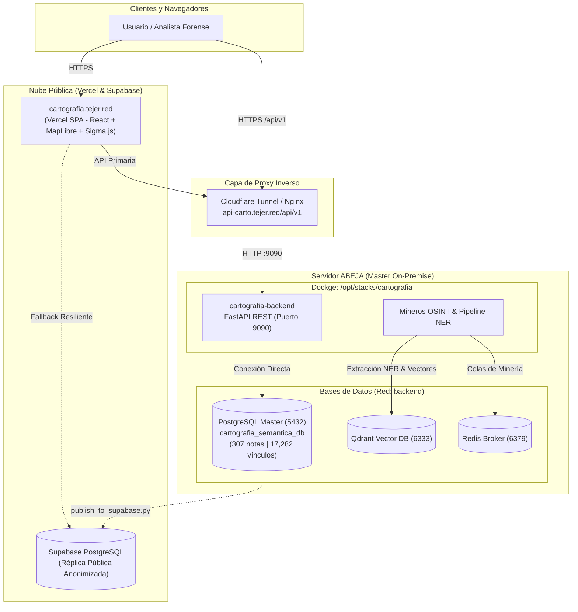

# 🗺️ Cartografía Semántica de Desaparecidos - Jalisco

Plataforma de inteligencia geoespacial, minería OSINT y análisis ontológico para la geolocalización, trazabilidad temporal y vinculación de reportes de personas desaparecidas, cédulas de búsqueda, fosas clandestinas y corpus periodístico en el estado de Jalisco.

---

## 🏛️ 1. Arquitectura General del Sistema

El proyecto opera bajo una arquitectura desacoplada que garantiza privacidad estricta de datos (PII) mediante cifrado determinista y sincronización en dos niveles (Master On-Premise y Réplica Pública):



* Para una descripción exhaustiva de puertos, redes y microservicios, consulta [`MICROSERVICIOS.md`](file:///home/abundis/temporal-ner-ontologia/MICROSERVICIOS.md).
* Para el estándar operativo de despliegue, consulta [`DEPLOY.md`](file:///home/abundis/temporal-ner-ontologia/DEPLOY.md).

---

## 💻 2. Comandos de Desarrollo Local

El desarrollo local utiliza aislamiento por entornos Conda/Node y recarga en caliente (*hot-reload*) para máxima agilidad sin interferir con producción:

### A. Backend Local (FastAPI / Uvicorn)
Levanta la API REST en el puerto local `8008`:

```bash
conda activate ner-cartografia && python -m uvicorn backend.app.main:app --host 0.0.0.0 --port 8008 --reload
```
* **Verificación de salud:** `curl -s http://localhost:8008/api/v1/health`
* **Swagger UI interactivo:** [http://localhost:8008/docs](http://localhost:8008/docs)
* **ReDoc:** [http://localhost:8008/redoc](http://localhost:8008/redoc)

### B. Frontend Local (React / Vite)
Levanta la interfaz web en el puerto `5173`:

```bash
export PATH=$HOME/miniconda3/envs/tejer-dev/bin:$PATH && npm run dev -- --host 0.0.0.0 --port 5173
```
* **Acceso web:** [http://localhost:5173](http://localhost:5173) (detecta automáticamente el backend local en `:8008`).

---

## 🚀 3. Comandos de Despliegue en Producción

### A. Frontend (Vercel CI/CD)
El frontend se compila y publica de forma automática en cada `push` a la rama de producción:
* **Rama de Producción:** `feature/ner-ontologia-mineria`
* **Dominio Público:** `https://cartografia.tejer.red`
* **Comando:**
  ```bash
  git push origin feature/ner-ontologia-mineria
  ```

---

### B. Backend (Docker en Servidor Abeja)
El backend de producción se ejecuta en el servidor `abeja` dentro de Dockge (`/opt/stacks/cartografia`) en el puerto `9090`.

> [!IMPORTANT]
> El despliegue en servidor remoto debe ser ejecutado manualmente por el usuario en dos fases:

#### Fase 1: Diagnóstico Previo (No Invasivo)
🐝 **En tu terminal SSH abierta en el servidor (`abeja`):**
```bash
# 1. Comprobar estado del contenedor y recursos del sistema
docker ps --filter "name=cartografia-backend"
free -h && df -h /

# 2. Verificar salud del servicio antes de cambios
curl -s -m 3 http://localhost:9090/api/v1/health || echo "Servicio no responde en 9090"
```

#### Fase 2: Ejecución del Despliegue
🐝 **En tu terminal SSH abierta en el servidor (`abeja`):**
```bash
# 1. Entrar al directorio del stack en Dockge
cd /opt/stacks/cartografia

# 2. Descargar los últimos cambios confirmados
git pull origin feature/ner-ontologia-mineria

# 3. Reconstruir la imagen y levantar el contenedor
docker compose up -d --build

# 4. Verificar salud del backend
sleep 3
curl -s http://localhost:9090/api/v1/health

# 5. Comprobar que lea los datos de la base Master
docker exec -it cartografia-backend python -c "from backend.app.database import SessionLocal; from backend.app.models import NoticiaCorpus, VinculoEntidad; db = SessionLocal(); print('Noticias:', db.query(NoticiaCorpus).count(), '| Vínculos:', db.query(VinculoEntidad).count())"
```

---

## 🧠 4. Funciones del Modelo NER y Pipeline Ontológico

El núcleo de inteligencia forense del sistema reside en el submódulo [`backend/app/ner/`](file:///home/abundis/temporal-ner-ontologia/backend/app/ner/) y en los mineros de [`backend/scripts/`](file:///home/abundis/temporal-ner-ontologia/backend/scripts/).

### A. Reconocimiento de Entidades Nombradas (GLiNER)
Utiliza **GLiNER** (Generalist and Lightweight Named Entity Recognition), un modelo de espacio cero (*zero-shot/few-shot*) basado en transformadores bidireccionales, optimizado para ejecutarse eficientemente tanto en GPU (RTX 5060 Ti) como en inferencia CPU ligera.

#### Clases y Spans Extraídos:
| Entidad / Span | Descripción | Ejemplo en Cédula o Nota |
| :--- | :--- | :--- |
| **`NOMBRE`** | Nombre propio de la persona reportada o referenciada | `"JUAN CARLOS HERNANDEZ PEREZ"` |
| **`DOMICILIO`** | Dirección, calle o cruce exacto de desaparición | `"AV. VALLARTA Y CALZADA DEL FEDERALISMO"` |
| **`MUNICIPIO`** | Municipio de los hechos normalizado | `"SAN PEDRO TLAQUEPAQUE"`, `"ZAPOPAN"` |
| **`FECHA`** | Fecha del evento o hallazgo (texto o numérica) | `"15 de octubre de 2024"`, `"2024-10-15"` |
| **`HORA`** | Registro temporal aproximado | `"14:30 hrs"`, `"madrugada"` |
| **`TELEFONO`** | Teléfono de contacto de búsqueda o emergencia | `"33-1234-5678"` |
| **`PLACA`** | Matrícula de vehículos involucrados | `"JHY-4589"` |
| **`EXP`** | Número de expediente, denuncia o carpeta de investigación | `"C.I. 12345/2024-III"` |
| **`MODUS_OPERANDI`**| Patrón o mecánica del suceso | `"SUJETOS ARMADOS EN VEHICULO SEDAN"` |
| **`RESTOS`** | Estimación forense de restos o indicios | `"3 segmentos óseos", "bolsas con indicios"` |
| **`FOSA`** | Términos indicadores de fosa o enterramiento | `"fosa clandestina", "predio de inhumación"` |

---

### B. Motor de Anonimización PII (`anonymizer.py`)
Protege la Información Personal Identificable (PII) bajo la normativa legal de datos sensibles antes de cualquier exposición en red o frontend:
* **Cifrado Determinista:** Aplica `HMAC-SHA256` utilizando una sal secreta (`PII_GLOBAL_SALT`). La misma entidad siempre produce el mismo identificador hash seguro (`[PER-a1b2c3d4]`, `[DOM-e5f6g7h8]`).
* **Inviolabilidad de Offsets:** Reemplazos aplicados en sentido inverso (derecha a izquierda) para garantizar que las posiciones de caracteres no se corrompan durante la sustitución.
* **Trazabilidad Forense:** Mapeo protegido almacenado en la tabla `pii_hash_registry` accesible únicamente por el backend Master.

---

### C. Normalización y Extracción Estructurada (`extractor.py`)
* **Fechas:** Convierte expresiones coloquiales en español (`"30 de octubre del 2024"`, `"dia 15/05/2023"`) a formato estándar ISO-8601 (`YYYY-MM-DD`).
* **Geografía:** Normaliza y valida municipios del Área Metropolitana de Guadalajara (AMG) e interior del estado de Jalisco, descartando ambigüedades.

---

### D. Pipeline de Minería y Grafos Ontológicos
Los scripts en `backend/scripts/` orquestan la generación del grafo relacional:

```bash
# 1. Minero de prensa y hallazgos en fuentes periodísticas abiertas (SearXNG)
python -m backend.scripts.miner_corpus_hallazgos

# 2. Vinculador geográfico de casos con fosas oficiales y fincas/domicilios compartidos
python -m backend.scripts.link_contexto_fosas_domicilios

# 3. Correlación semántica y espacio-temporal de noticias periodísticas con cédulas
python -m backend.scripts.linker_noticias_casos

# 4. Sincronización unidireccional de datos anonimizados hacia Supabase Réplica
python -m backend.scripts.publish_to_supabase
```

#### Tipos de Vínculos en el Grafo Ontológico (`vinculos_entidades`):
* `POSIBLE_HALLAZGO_EN_FOSA`: Correlación espacial entre última ubicación y fosa oficial documentada.
* `DESAPARECIO_EN_DOMICILIO`: Múltiples casos con el mismo punto o cruce geográfico (eventos múltiples / fincas).
* `POSIBLE_HALLAZGO_RELACIONADO`: Noticia periodística que coincide temporalmente y espacialmente con la desaparición.
* `MODUS_OPERANDI`: Conexión de casos con patrones operativos similares documentados en la investigación.

---

## 🔒 5. Políticas de Seguridad y Manejo de Secretos

* **Cero Credenciales en Código:** Queda estrictamente prohibido guardar contraseñas o tokens en el código fuente.
* **Configuración Parametrizada:** Toda variable sensible debe existir únicamente en archivos `.env` (incluidos en `.gitignore`) o en los paneles de variables de entorno de Vercel/Dockge.
* **Plantilla de Referencia:** Utiliza `.env.example` para identificar las variables requeridas por el sistema.
