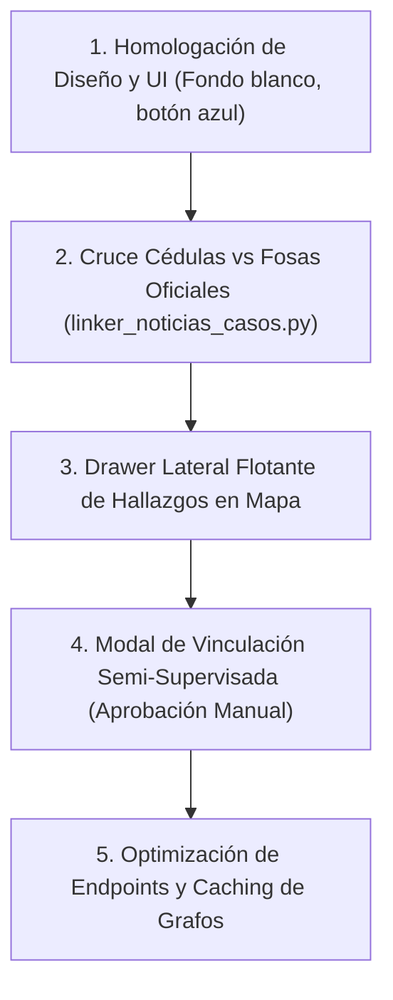

# Bitácora de Tareas Pendientes y Roadmap (`TODO-LIST.md`)

Este documento centraliza el inventario técnico de tareas del proyecto **Cartografía Semántica de Desaparecidos en Jalisco**, detallando la justificación, arquitectura, impacto metodológico y prioridad de cada frente.

---

## 🗺️ Mapa de Ruta General (Roadmap)

---

## 📋 Inventario Detallado de Tareas

### 1. Homologación Estética del Panel de Hallazgos y Sidebar
- **Estado:** 🟡 En Ejecución Inmediata
- **Capa:** Frontend (`LeftSideBar.jsx`, `PanelHallazgosCorpus.jsx`, `FilterForm.css`)
- **Importancia Técnica y Metodológica:**
  - **Coherencia Visual:** El sidebar principal utiliza fondo blanco (`#ffffff`), bordes sutiles (`#e2e8f0` / `#cccccc`) y botones primarios azules (`#007bff` o `--primary-color`), mientras que `PanelHallazgosCorpus.jsx` fue diseñado inicialmente con tema oscuro nocturno (`#0f172a` / `#020617`).
  - **Experiencia de Usuario (UX):** Unificar la paleta previene fatiga visual, armoniza el acordeón *"Fosas y Hallazgos Colectivos (Corpus)"* con los acordeones de *"Filtros"* y *"Estadísticas"*, y hace que los botones de acción (`Centrar`, `Vincular`) utilicen el azul estándar del sistema.
  - **Legibilidad Tipográfica:** Garantiza contraste AA/AAA accesible con tipografía en escala de grises oscuros (`#0f172a`, `#334155`) sobre fondos limpios.

---

### 2. Algoritmo de Cruce contra Catálogo Oficial de Fosas Clandestinas
- **Estado:** ⏳ Pendiente Prioritario
- **Capa:** Backend / Inteligencia Algorítmica (`backend/scripts/linker_noticias_casos.py`, `backend/app/models.py`)
- **Importancia Técnica y Metodológica:**
  - **Cierre de la Brecha Oficial vs OSINT:** El sistema actualmente cuenta con **1,290 vínculos** entre personas desaparecidas y notas periodísticas de hallazgos del corpus. Sin embargo, Jalisco cuenta con **71 registros oficiales de fosas clandestinas** georreferenciadas en la tabla `fosas`.
  - **Rigor Forense:** Al cruzar las 5,542 cédulas contra las fosas oficiales mediante la fórmula de afinidad espacio-temporal ($S = 0.50 S_{\text{espacial}} + 0.30 S_{\text{temporal}} + 0.20 S_{\text{contexto}}$), se generan hipótesis sólidas de investigación para colectivos de búsqueda y ministerios públicos.
  - **Enriquecimiento del Grafo:** Permite generar relaciones `VINCULO_FOSA_OFICIAL` en la tabla `vinculos_entidades`, habilitando consultas bidireccionales en el frontend.

---

### 3. Drawer Flotante / Cajón Lateral de Hallazgos en Mapa
- **Estado:** ⏳ Pendiente
- **Capa:** Frontend (`DrawerHallazgosCorpus.jsx`, `AppLayout.jsx`)
- **Importancia Técnica y Metodológica:**
  - **Exploración No Invasiva:** Permite abrir y colapsar la lista de notas de hallazgos directamente desde el borde derecho del mapa mediante una pestaña saliente, sin ocupar espacio permanente en el sidebar izquierdo de filtros.
  - **Sincronización con Viewport:** Al mover o hacer zoom en el mapa, el drawer filtra automáticamente para mostrar únicamente los eventos que caen dentro del encuadre geográfico actual del investigador.

---

### 4. Modal de Vinculación Semi-Supervisada (Human-in-the-Loop)
- **Estado:** ⏳ Pendiente
- **Capa:** Frontend & Backend (`LinkModal.jsx`, `backend/app/routes/ontology.py`)
- **Importancia Técnica y Metodológica:**
  - **Validación Humana:** Los modelos probabilísticos y de lenguaje generan sugerencias de coincidencia caso $\leftrightarrow$ hallazgo. No obstante, una imputación forense requiere la confirmación explícita de un analista humano.
  - **Trazabilidad:** El modal permite al usuario revisar la distancia en km, los días de desfase y el resumen de la nota, haciendo clic en *Confirmar Vínculo* o *Descartar Falso Positivo*, guardando el veredicto en la base de datos con estatus `CONFIRMADO` o `RECHAZADO`.

---

### 5. Optimización de Caching y Endpoints de Grafos Semánticos
- **Estado:** ⏳ Pendiente
- **Capa:** Backend / Servidor de Despliegue (`FastAPI`, `ontology.py`)
- **Importancia Técnica y Metodológica:**
  - **Escalabilidad de Grafo:** El cálculo del subgrafo ontológico para miles de nodos puede demandar tiempo computacional si se recalcula en cada petición. Implementar cache en memoria (LRU / Redis) para consultas por municipio y grados de separación.
