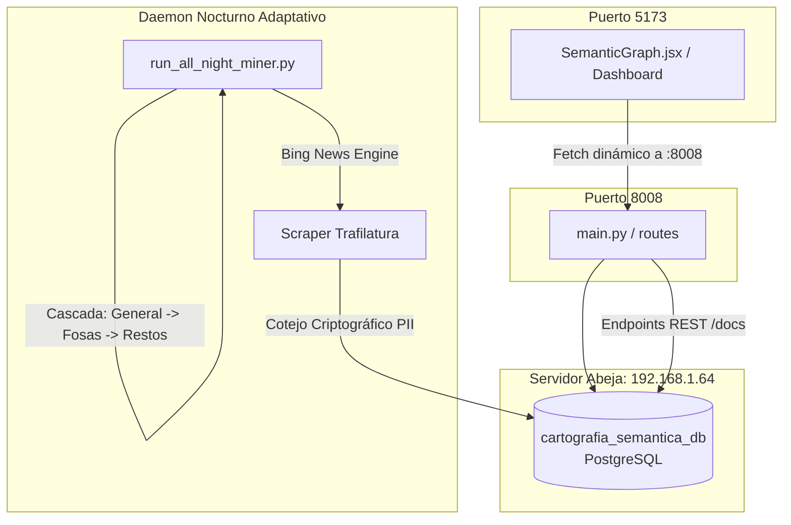

# Reporte General del Sistema y Estado Integral del Ecosistema

**Fecha de Generación:** 21 de Septiembre de 2026, 23:59 hrs  
**Estado:** Totalmente Operativo y Desplegado en Red Local  
**Base Central:** PostgreSQL en `abeja` (`192.168.1.64:5432/cartografia_semantica_db`)  

---

## 1. Enlaces de Acceso Inmediato

El frontend interactivo y el backend de microservicios REST están desplegados y accesibles desde cualquier equipo conectado a tu red local o Tailscale:

| Servicio | Enlace Red Local (LAN) | Enlace Tailscale (Remoto) | Estado |
| :--- | :--- | :--- | :--- |
| **Frontend Web Interactivo** | [http://192.168.1.72:5173/](http://192.168.1.72:5173/) | [http://100.82.101.7:5173/](http://100.82.101.7:5173/) | Activo (Vite 6 / React 19) |
| **API Backend (FastAPI)** | [http://192.168.1.72:8008/docs](http://192.168.1.72:8008/docs) | [http://100.82.101.7:8008/docs](http://100.82.101.7:8008/docs) | Activo (Uvicorn 8008) |
| **Grafo Ontológico REST** | [http://192.168.1.72:8008/api/v1/ontology/graph?limit_edges=200](http://192.168.1.72:8008/api/v1/ontology/graph?limit_edges=200) | [http://100.82.101.7:8008/api/v1/ontology/graph?limit_edges=200](http://100.82.101.7:8008/api/v1/ontology/graph?limit_edges=200) | Activo |

---

## 2. Métricas y Estadísticas Globales del Ecosistema

| Entidad / Componente | Cantidad Actual | Descripción y Notas |
| :--- | :--- | :--- |
| **Cédulas Históricas Privadas** | **5,542** | Universo completo de fichas de búsqueda con narrativas y ubicaciones. |
| **Hashes Criptográficos PII** | **15,115** | Nombres, teléfonos y domicilios tokenizados con HMAC-SHA256 para preservar privacidad. |
| **Fosas Clandestinas** | **71** | Hallazgos georreferenciados del Registro Estatal Limpio (`api/estatal_limpio_with_lat_lng.csv`). |
| **Noticias OSINT Minadas** | **556+** | Artículos completos de prensa con titulares, enlaces y texto procesado. |
| **Vínculos Ontológicos Totales** | **2,461+** | Aristas semánticas y de correlación espacial/temporal en `vinculos_entidades`. |
| **Casos Evaluados en la Noche** | **> 925** | Fichas analizadas cronológicamente de las más recientes a las más antiguas. |

### Distribución de Vínculos en el Grafo Ontológico
* `MENCIONADO_EN_NOTICIA`: **2,168** relaciones (casos o hashes PII vinculados a coberturas de prensa).
* `REVISADO_SIN_NOTICIA`: **202** casos evaluados y marcados como sin correlación para no repetir búsquedas.
* `DESAPARECIO_JUNTO_A`: **51** conexiones entre personas o eventos simultáneos.
* `REGISTRA_HALLAZGO_EN_FOSA`: **28** cruces espaciales directos con fosas clandestinas.
* `FAMILIAR_DE` / `REPORTO_MISMO_EVENTO`: **12** aristas de parentesco y reporte.

---

## 3. Resumen de Componentes Clave

### Principales Innovaciones del Sistema:
1. **Diccionario Evolutivo Adaptativo:**  
   Si la consulta inicial (`"hallazgo cuerpo"`) no arroja resultados, el sistema intenta de forma inmediata y automática clusters semánticos especializados (`"fosa clandestina"`, `"restos humanos embolsado / en maleta"`), aumentando la tasa de recuperación de hallazgos.
2. **Privacidad y Zero-Knowledge PII:**  
   La correlación cruzada de nombres y domicilios se ejecuta contra hashes criptográficos HMAC-SHA256, garantizando que los datos confidenciales nunca queden expuestos en claro en el grafo público.
3. **Pacing de Consulta No Invasivo:**  
   Jitter ágil calibrado entre 3.5s y 6.0s que garantiza un flujo continuo de ~600 a 700 casos por hora sin provocar bloqueos de IP ni sobrecargas.
